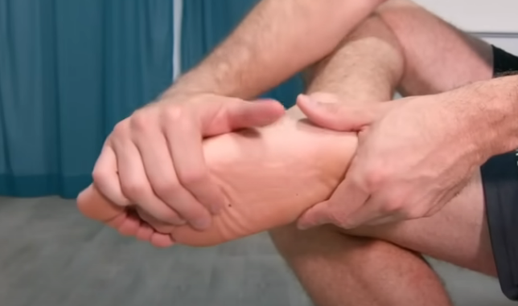
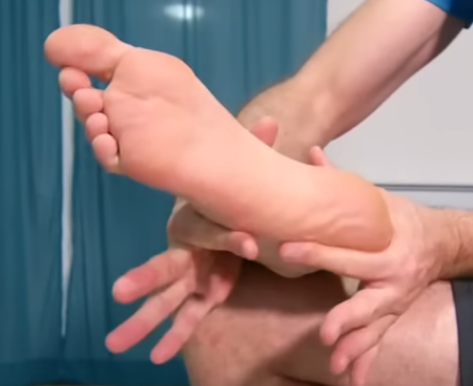
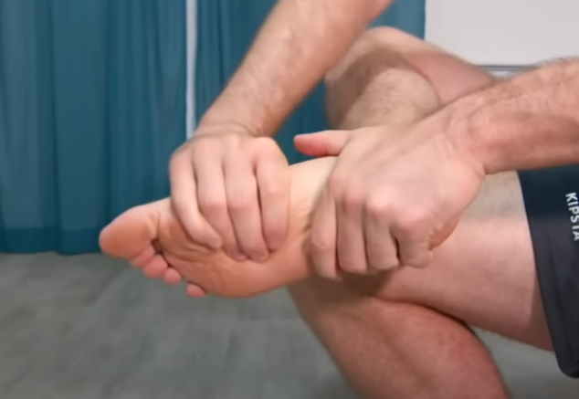
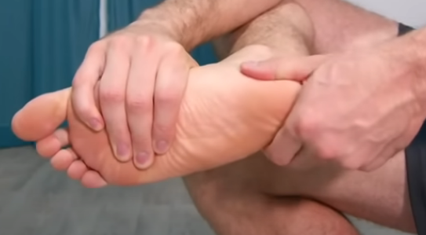
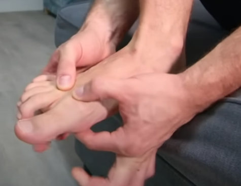
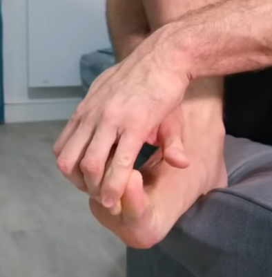
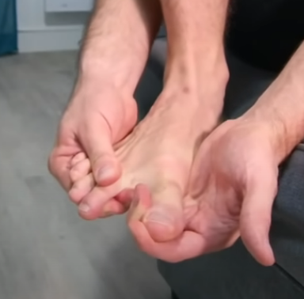
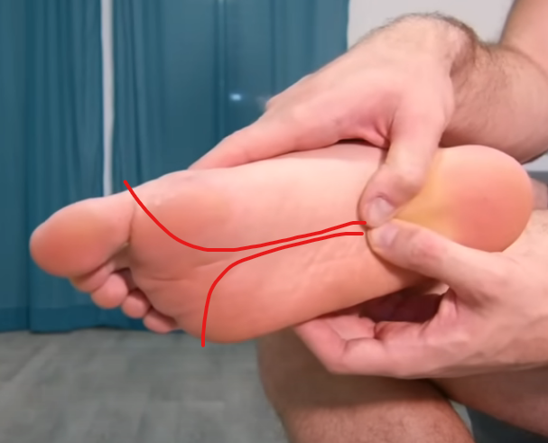

# Tensión Muscular en la planta del pie
	- ## Masaje
	- Se parte con el pie cruzado sobre la otra pierna. 
	  Se estira con las manos hacia abajo del pie y hacia arriba 10 veces manteniendo 2s en cada extremo.
	- Luego se toma el pie para hacer un movimiento análogo pero perpendicular. 
	  Nuevamente 10 repeticiones 2s en cada extremo.
	- Ahora se toma el pie como un trapo el cual se quiere escurrir 
	- Ahora se toma de forma firme con una mano para evitar mover el tobillo. Con la otra mano se toma el talón del pie y se realizan movimientos circulares para movilizar los cartílagos. 
	  10 círculos por cada sentido.
	- Se apoya el talón del pie al borde
	   
	  Colocando los dedos atrás de cada par de dedos seguidos se realizan movimientos de arriba hacia abajo (cruzados). 10 veces en cada par de dedos seguidos.
	- Ahora se toman los dedos del pie desde abajo y se estiran hacia arriba
	  
	  Esto se mantiene 2s, se hace el estiramiento opuesto (hacia abajo) y se repite 10 veces.
	- Ahora se separa el pulgar del resto de dedos, alineandolo con su tendón
	  
	  Esto se mantiene 30s
	- Se vuelve a cruzar el pie y ahora se masajea la planta
	  
	  Haciendo presión desde que comienza la parte suave de la planta se sigue una linea recta hasta finalizar la parte suave de la planta y se separan los pulgares en direcciones opuestas. Esto se repite varias veces moviendo la linea recta a diferentes lugares de la planta.
	-
	-
	-
	-